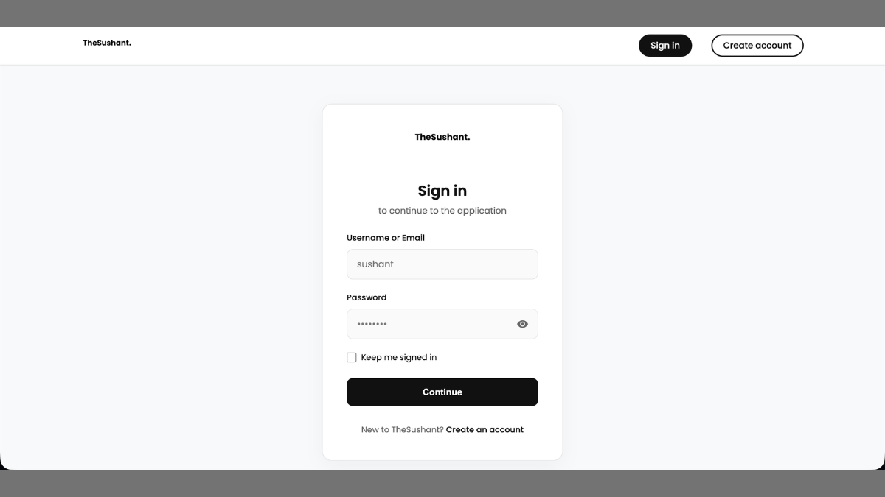
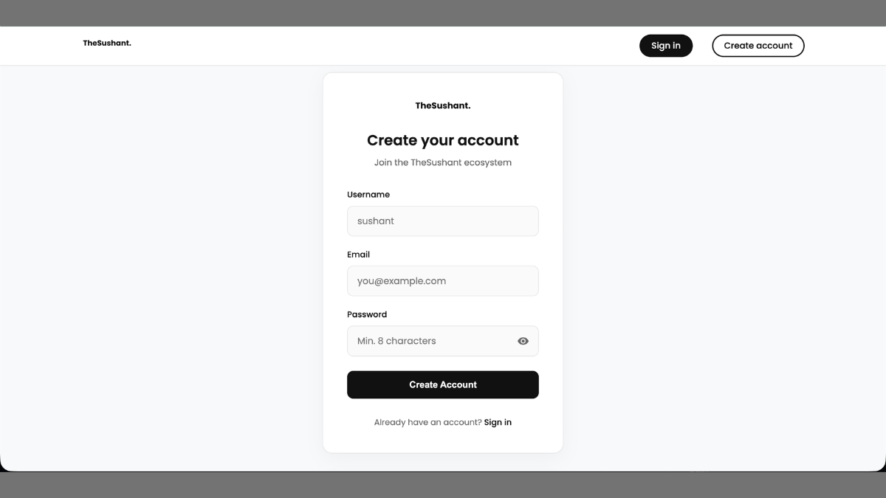
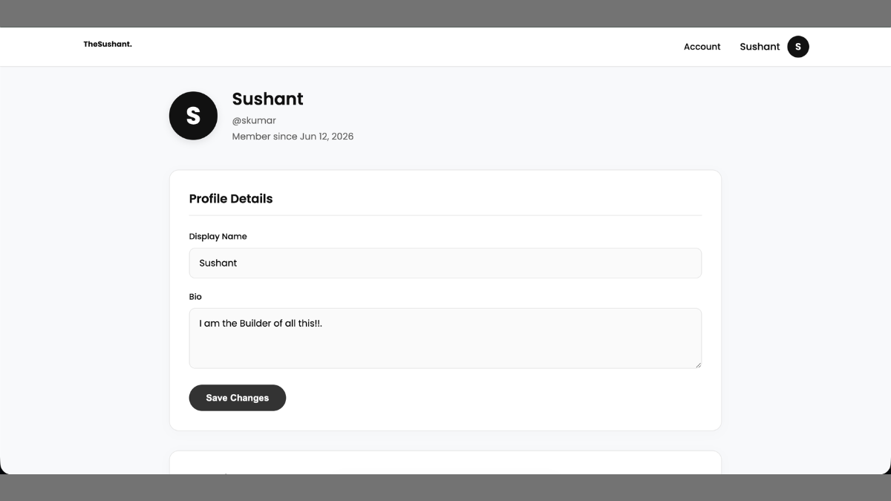
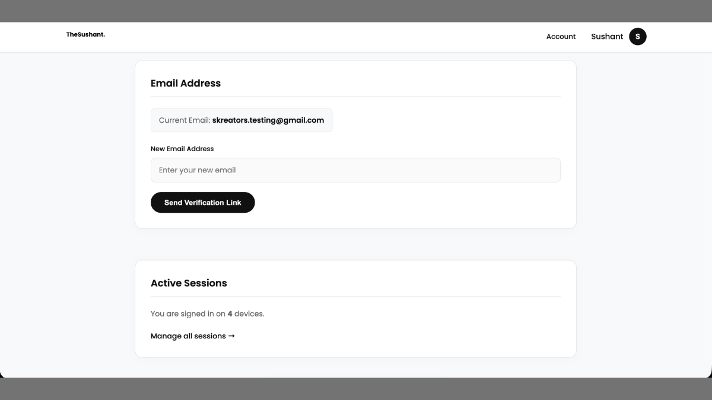
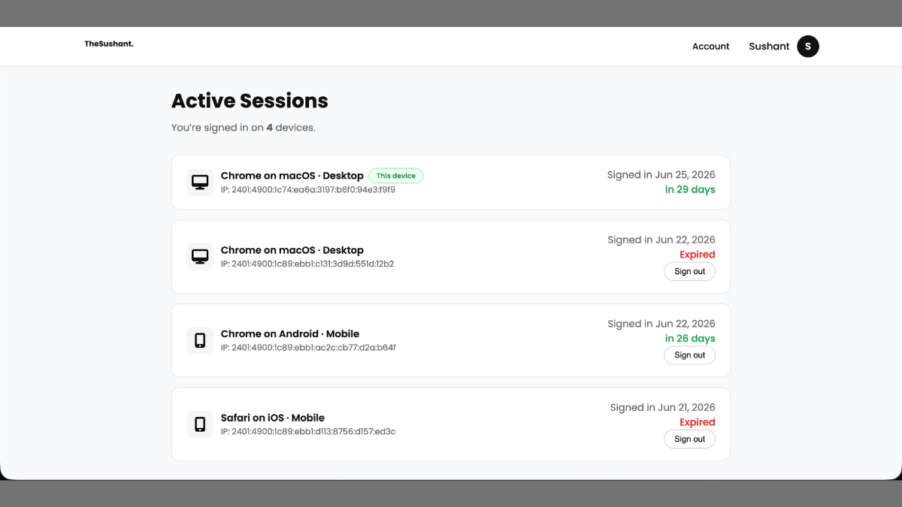

# Centralized Authentication Platform

A production-ready centralized authentication platform built to provide secure user identity, session management, and Single Sign-On (SSO) across multiple web applications.

---

## Overview

The Centralized Authentication Platform was designed to eliminate the need for separate login systems across multiple projects by providing a unified identity service.

Applications integrate with a single authentication provider, allowing users to securely register once, sign in once, and access multiple systems using the same account.

The platform also manages active sessions, user identities, and secure authentication workflows.

---

## Key Features

### Authentication

* Secure user registration
* Secure login system
* Password hashing
* Session-based authentication
* Remember Me functionality

### Identity Management

* UUID-based user identities
* Centralized user accounts
* Profile management
* Cross-application authentication

### Session Management

* Active session tracking
* Multi-device login support
* Session revocation
* Secure session lifecycle management

### Single Sign-On (SSO)

* Unified authentication across applications
* Shared identity provider
* Cookie-based authentication
* Simplified integration for internal systems

---

## Technology Stack

* PHP
* MySQL
* HTML
* CSS
* JavaScript

---

## Screenshots

### Login



### Registration



### User Dashboard



### Dashboard (Extended View)



### Active Sessions



---

## Authentication Flow

```text
User
   │
   ▼
Login / Register
   │
   ▼
Authentication Server
   │
   ├── Validate Credentials
   ├── Generate Session
   ├── Assign UUID
   └── Store Session
   │
   ▼
MySQL
   │
   ▼
Authenticated Applications
```

---

## Highlights

* Centralized authentication architecture
* UUID-based identity management
* Secure session handling
* Multi-application integration
* Active session monitoring
* Production-ready implementation

---

## Future Improvements

* OAuth 2.0 support
* OpenID Connect compatibility
* Multi-Factor Authentication (MFA)
* Email verification
* Password reset workflow
* API tokens
* Developer SDKs

---

## Status

Production-ready authentication service actively used across multiple internal web applications.

---

## Author

**Sushant Kumar**

Portfolio:
https://thesushant.in/portfolio

Website:
https://thesushant.in
